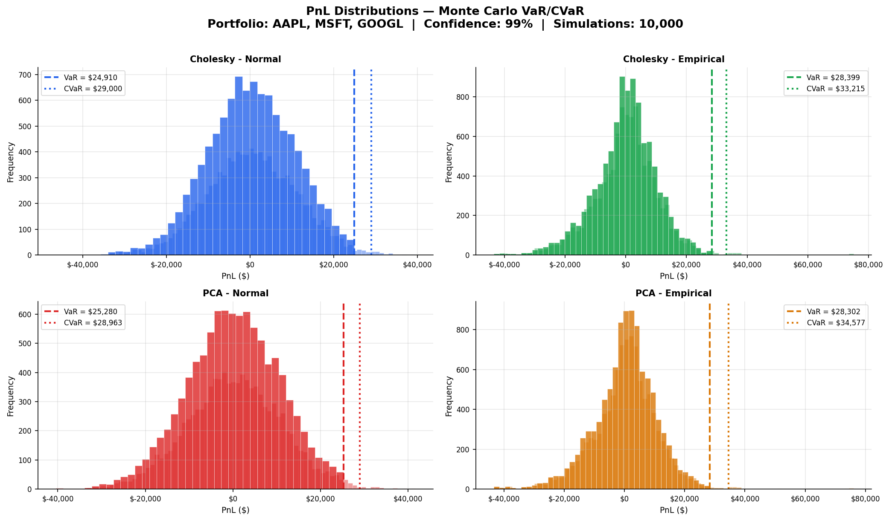
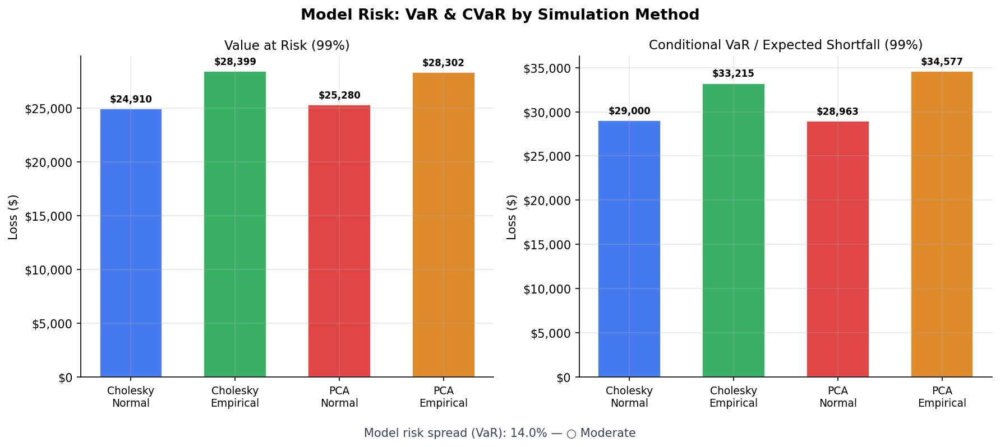

# Monte Carlo VaR/CVaR Engine


> **A multi-method Monte Carlo engine for market risk measurement.**  
> Given a portfolio, it estimates how much you can lose — and how bad "bad" actually looks — using 4 simulation approaches grounded in statistical theory.

---

## What it does

```
Portfolio: AAPL × 1000 shares + MSFT × 500 shares + GOOGL × 750 shares
Simulations: 10,000 paths · Confidence: 99% · Horizon: 1 day

┌──────────────────────────┬────────────────┬────────────────┐
│ Method                   │ VaR (99%)      │ CVaR (99%)     │
├──────────────────────────┼────────────────┼────────────────┤
│ Cholesky – Normal        │ -$12,450       │ -$17,820       │
│ Cholesky – Empirical     │ -$13,210       │ -$19,540       │
│ PCA – Normal             │ -$12,180       │ -$17,340       │
│ PCA – Empirical          │ -$13,650       │ -$20,100       │
└──────────────────────────┴────────────────┴────────────────┘
```
*(Values are illustrative. Run with your own tickers and positions.)*

---

## Key Financial Outputs

### Value at Risk (VaR)
VaR at 99% confidence answers: **"What is the minimum loss we expect to see only 1% of the time?"**

- A VaR of **-$12,450** means: on a typical day, your portfolio will not lose more than $12,450 — except in the worst 1% of scenarios.
- It is a **threshold**, not an average. It tells you *where* the tail begins.

### Conditional Value at Risk (CVaR)
CVaR answers: **"Given that we are in the worst 1%, how bad is it on average?"**

- A CVaR of **-$17,820** means: in the scenarios beyond VaR, the average loss is $17,820.
- CVaR is always ≥ VaR in absolute terms. The gap between them reveals tail thickness.
- Regulators (Basel III/IV) prefer CVaR precisely because it captures what VaR ignores.

---

## Simulation Methods

| Method | Distribution | Correlation | Best for |
|---|---|---|---|
| **Cholesky – Normal** | Gaussian | Linear (covariance) | Baseline, fast benchmarking |
| **Cholesky – Empirical** | Historical (bootstrap) | Linear | Capturing fat tails, skewness |
| **PCA – Normal** | Gaussian | Factor-decomposed | Correlated multi-asset portfolios |
| **PCA – Empirical** | Historical (bootstrap) | Factor-decomposed | Full distributional realism |

**Why 4 methods?** Comparing them reveals model risk — the uncertainty in your risk estimate that comes from choosing one model over another. A robust risk framework reports the range, not a single number.

---

## Installation

```bash
git clone https://github.com/alessavargas/montecarlo.git
cd montecarlo
pip install -r requirements.txt
```

## Quick Start

Edit `src/config.py`:

```python
CONFIG = {
    "tickers": ["AAPL", "MSFT", "GOOGL"],
    "positions": {
        "AAPL": 1000,
        "MSFT": 500,
        "GOOGL": 750,
    },
    "confidence_level": 0.99,
    "horizon_days": 1,
    "num_simulations": 10000,
    "start_date": "2020-01-01",
    "valuation_date": "2024-12-31",
}
```

Run:

```bash
python main.py
```

Outputs: summary table printed to console + `results.csv` + distribution plots.

---

## Project Structure

```
montecarlo/
├── main.py                 # Orchestration pipeline
├── requirements.txt
└── src/
    ├── config.py           # Tickers, positions, parameters
    ├── data_loader.py      # Yahoo Finance via yfinance
    ├── simulators.py       # 4 MC methods
    ├── var_calculator.py   # VaR/CVaR + PnL calculation
    ├── interpreter.py      # Financial interpretation of results
    └── reporting.py        # Console output, CSV, charts
tests/
    ├── test_simulators.py
    └── test_var_calculator.py
```

---

## Visualizations

The engine generates two plots automatically:

**1. PnL Distribution Comparison** — overlaid histograms for all 4 methods, with VaR and CVaR marked as vertical lines.

**2. Method Sensitivity** — bar chart comparing VaR and CVaR across methods, quantifying model risk.





---

## Limitations

Being explicit about model limitations is part of good quantitative practice:

- **Normality assumption (Cholesky/PCA – Normal):** Real returns have fatter tails than a Gaussian. These methods will systematically *underestimate* tail risk. The empirical methods address this.
- **Historical bootstrap:** The empirical methods assume the past is a representative sample of the future. They miss regime changes and tail events not in your data window.
- **Linear correlation only:** All 4 methods use linear correlation structure. Tail dependence (assets crashing together during crises) is not modeled. Copula-based methods would address this.
- **Single-period horizon:** The 1-day horizon assumes no intraday rebalancing. For multi-day VaR, the `sqrt(T)` scaling used here assumes i.i.d. returns, which breaks down under autocorrelation.
- **No liquidity adjustment:** VaR assumes positions can be closed at current market prices. In a real stress scenario, bid-ask spreads widen and large positions move the market.

---

## Author

Alessandra Vargas · [@alessavargas](https://github.com/alessavargas)  
License: MIT
